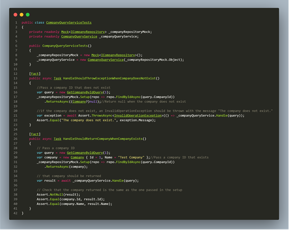
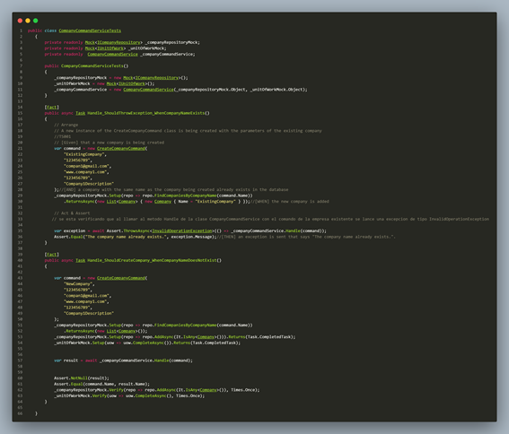

# Testing Suite Evidence

Plantilla para la documentacion:

### 1. **Unit Test**
* Clase: Indica el nombre de la clase que contiene el método a probar (ej. NombreClase).
* Método: Especifica el nombre del método a probar (ej. metodoClase).

* Comportamiento: Describe lo que hace el método y el comportamiento que se está validando (ej. "Valida si los datos de entrada son correctos").

* Resultado esperado: Explica el resultado que se espera. Por ejemplo: “El método metodoClase lanza una ValidationException cuando se recibe un dato en un formato incorrecto”.

### 2. **Integration Test**
* Componentes: Enumera los métodos y/o módulos que interactúan en la prueba (ej. AuthService.authenticateUser y UserRepository.findUser).

* Escenario: Describe cómo se integran los componentes y el contexto de la prueba (ej. "Validar que AuthService usa correctamente UserRepository para verificar credenciales de usuario").

* Resultado Explica el comportamiento esperado, por ejemplo: "authenticateUser devuelve true cuando los métodos funcionan correctamente con credenciales válidas, y false cuando no lo son".


>  La formación del archivo.feature deberia de tener un nombre estandar para todos seria CodigoUserStory_Titulo.feature. Condicion.feature.


BackEnd
```gherkin
TS001: 
Feature: idicar que es lo que haria como develop. en INGLES.  
  Scenario: completar
    Given completar
    When completar
    Then completar.

    |ejm| ejm| 
```
> Aqui se pondria la imagen de las pruebas con postman de las pruebas con la api las cuales se subiran con sus respectivos nombres a la carperta resource.

## Test Company

### 1. **Unit Test**
* Clase: CompanyQueryService
* Método: GetCompanyByIdQuery.
* Comportamiento: Este método busca una compañía utilizando su identificador único con el objetivo de retornar únicamente la información de dicha compañía.
* Resultado esperado:  Al invocar el método GetCompanyByIdQuery con un ID válido, se espera que retorne un único objeto Company cuyo identificador coincida con el ID proporcionado. Esto verifica que la búsqueda se realiza correctamente y retorna únicamente la compañía solicitada.

### 2. **Integration Test**
* Componentes: Cuenta con las funciones FindCompaniesByCompanyName y AddAsync.

* Escenario: Se integra la validación en el comando CreateCompanyCommand para crear una nueva empresa. Se requiere que el nombre de la empresa sea único, es decir, que no exista otra empresa con el mismo nombre registrado. Esto es fundamental para evitar confusiones entre los clientes y garantizar una buena experiencia de usuario.

* Resultado: Al intentar crear una empresa con un nombre ya existente, el sistema debe mostrar un mensaje de error como "The company name already exists". De esta manera, se impide el registro duplicado y se solicita al usuario que proporcione un nombre único.


BackEnd
```gherkin
Feature: As a developer, I want to validate that I can find a company by its identifier and that duplicate companies with the same name cannot be created.

  Scenario: Retrieve a company by ID
    Given a valid company ID exists in the system
    When I call the GetCompanyByIdQuery with this ID
    Then I should receive a single Company object matching the provided ID

  Scenario: Prevent duplicate company names on creation
    Given a company with the name "Test Company" already exists
    When I attempt to create a new company with the name "Test Company"
    Then I should see an error message stating "The company name already exists"
    And the company should not be created

```
