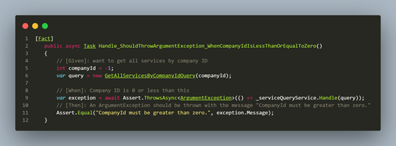
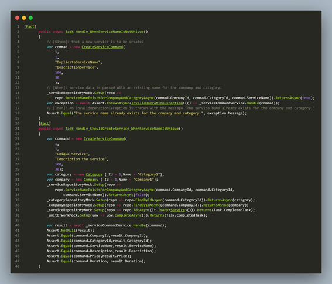

# Testing Suite Evidence

Plantilla para la documentacion:

### 1. **Unit Test**
* Clase: Indica el nombre de la clase que contiene el método a probar (ej. NombreClase).
* Método: Especifica el nombre del método a probar (ej. metodoClase).

* Comportamiento: Describe lo que hace el método y el comportamiento que se está validando (ej. "Valida si los datos de entrada son correctos").

* Resultado esperado: Explica el resultado que se espera. Por ejemplo: “El método metodoClase lanza una ValidationException cuando se recibe un dato en un formato incorrecto”.

### 2. **Integration Test**
* Componentes: Enumera los métodos y/o módulos que interactúan en la prueba (ej. AuthService.authenticateUser y UserRepository.findUser).

* Escenario: Describe cómo se integran los componentes y el contexto de la prueba (ej. "Validar que AuthService usa correctamente UserRepository para verificar credenciales de usuario").

* Resultado Explica el comportamiento esperado, por ejemplo: "authenticateUser devuelve true cuando los métodos funcionan correctamente con credenciales válidas, y false cuando no lo son".


>  La formación del archivo.feature deberia de tener un nombre estandar para todos seria CodigoUserStory_Titulo.feature. Condicion.feature.


BackEnd
```gherkin

Feature: idicar que es lo que haria como develop. en INGLES.  
  Scenario: completar
    Given completar
    When completar
    Then completar.

    |ejm| ejm| 
```
> Aqui se pondria la imagen de las pruebas con postman de las pruebas con la api las cuales se subiran con sus respectivos nombres a la carperta resource.
## Service Test

### 1. **Unit Test**
* Clase: ServiceQueryService
* Método: GetAllServicesByCompanyIdQuery

* Comportamiento: lo que realiza es obtener todos los servicios que tiene una compañia

* Resultado esperado: El método GetAllServicesByCompanyIdQuery lanza una excepcion cuando se pasa el identificador de la compañia es menor e igual a 0.



### 2. **Integration Test**
* Componentes: serviceRepository.ServiceNameExistsForCompanyAndCategoryAsync y serviceRepository.AddAsync.

* Escenario: ServiceNameExistsForCompanyAndCategoryAsync es usado para verificar que el nombre del servico no se repita dentro de las categorias de la comañia para luego ser agragda con AddAsync.

* Resultado: ServiceNameExistsForCompanyAndCategoryAsync devuelve true cuando el nombre del servicio existe en una categoria de la compañia, lo que al ser true lanzara una Exception con el mensaje "The service name already exists for the company and category."




```gherkin
Feature: 

  Scenario: Retrieve all services by company ID with invalid ID
    Given I have a company ID that is less than or equal to 0
    When I call the GetAllServicesByCompanyIdQuery with this ID
    Then an exception should be thrown
    And the exception message should indicate an invalid company ID

  Scenario: Prevent duplicate service names within the same company and category
    Given a service with the name "Service1" exists in a category for a company
    When I attempt to add a new service with the name "Service1" in the same category for that company
    Then ServiceNameExistsForCompanyAndCategoryAsync should return true
    And an exception should be thrown with the message "The service name already exists for the company and category."
```
